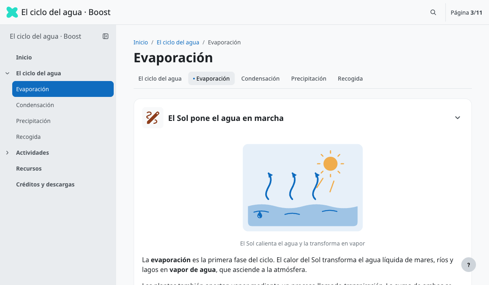

# eXeLearning Boost

[![eXeLearning 4.0.5+](https://img.shields.io/badge/eXeLearning-4.0.5%2B-26ddc7?labelColor=1f2937&logo=data%3Aimage%2Fsvg%2Bxml%3Bbase64%2CPHN2ZyB4bWxucz0iaHR0cDovL3d3dy53My5vcmcvMjAwMC9zdmciIHZpZXdCb3g9IjAgLTAuNTE5IDYwLjE3MTUyIDYwLjE3MTUyIj4gPGcgdHJhbnNmb3JtPSJ0cmFuc2xhdGUoLTEwOS44MDIwOCwtMTIxLjE3OTE3KSI%2BIDxwYXRoIGQ9Im0gMTIwLjYzOTEyLDEyMS4xNzkxNiBjIDIuNTAyOTYsMCA1LjE3Njg0LDAuOTEwMiA4LjAyMTExLDIuNzMwNiAyLjc4NzY1LDEuNzYzNSA2LjYyNzU1LDQuODkyMzMgMTEuNTE5Nyw5LjM4NjQ0IDguNDE5MywtNy4wNTQwNiAxMi45MTAzNCwtOC42NDMwMSAxNy4yMzM2MywtOC42NDMwMSAyLjc4NzY1LDAgNS4xNzY4NCwwLjc2Nzk4IDcuMTY3ODMsMi4zMDM5NCAzLjY2NzkyLDIuODA0NzcgNC4yNzk2Myw5LjIxMDIyIDEuNzEsMTMuNDIxNTcgLTIuMDQ3ODcsMy4zNTYzNyAtNC43MjE3NSw2Ljk2ODczIC04LjAyMTExLDEwLjgzNzAxIDcuNTA5MTQsOC41MzMwOCAxMS43MDMzMiwxNC42NzMgMTEuNzAzMzIsMTguODgyNzkgMCwzLjAxNDkyIC0wLjkzODc0LDUuMzE4OTIgLTIuODE1OTYsNi45MTE3MSAtMS45MzQxMSwxLjU5Mjc5IC00LjM1MTg3LDIuMzg5MTkgLTcuMjUzMDMsMi4zODkxOSAtNC4zODA0NCwwIC0xMS4yNDg0OSwtMy4zMjM3IC0xOS43MjQ2OCwtMTAuNDM0NjQgLTQuODM1MjYsNC4yNjY0IC04LjY0Njg1LDcuMjI0NzEgLTExLjQzNDI0LDguODc0MzkgLTIuODQ0NTMsMS42NDk2NyAtNS41NDY3MiwyLjQ3NDY1IC04LjEwNjU3LDIuNDc0NjUgLTMuNDEzMjMsMCAtNi4wNTg1LC0xLjEwOTQgLTcuOTM1NzgsLTMuMzI3OTMgLTEuOTM0MTgsLTIuMjc1NjggLTIuOTAxMjYsLTQuOTQ5MyAtMi45MDEyNiwtOC4wMjExMSAwLC0xLjk5MTI2IDAuMjg0NDMsLTMuNzI2MTMgMC44NTMzMSwtNS4yMDU0MSAwLjU2ODg4LC0xLjQ3OTAzIDEuNjIxMjksLTMuMTI4NyAzLjE1NzI1LC00Ljk0OTA0IDEuNTM1OTYsLTEuODc3NDggMy45ODIxMywtNC40NjU2MyA3LjMzODQ1LC03Ljc2NTI1IC0zLjI0MjU0LC0zLjI5OTM2IC01LjYzMTgxLC01Ljk0NDcxIC03LjE2NzgsLTcuOTM1NzYgLTEuNTkyODQsLTIuMDQ3OTUgLTIuNjczNjksLTMuODM5OTIgLTMuMjQyNTcsLTUuMzc1ODggLTAuNjI1NzcsLTEuNTM1OTYgLTAuOTM4NjQsLTMuMjQyNTcgLTAuOTM4NjQsLTUuMTE5ODcgMCwtMS45OTEwNyAwLjQyNjY0LC0zLjgzOTkgMS4yNzk5NSwtNS41NDY1MSAwLjg1MzM0LC0xLjc2MzUzIDIuMTA0ODQsLTMuMTg1NzIgMy43NTQ2LC00LjI2NjU4IDEuNjQ5NzMsLTEuMDgwODcgMy41ODM5MSwtMS42MjEzIDUuODAyNDksLTEuNjIxMyB6IiBmaWxsPSIjMjZkZGM3Ii8%2BIDwvZz4gPC9zdmc%2B)](https://exelearning.net)
[](https://github.com/ateeducacion/exelearning-style-boost/raw/refs/heads/main/content/resources/boost.zip)
[![Edit in eXeLearning](https://img.shields.io/badge/Edit%20in-eXeLearning-26ddc7?labelColor=1f2937&logo=data%3Aimage%2Fsvg%2Bxml%3Bbase64%2CPHN2ZyB4bWxucz0iaHR0cDovL3d3dy53My5vcmcvMjAwMC9zdmciIHZpZXdCb3g9IjAgLTAuNTE5IDYwLjE3MTUyIDYwLjE3MTUyIj4gPGcgdHJhbnNmb3JtPSJ0cmFuc2xhdGUoLTEwOS44MDIwOCwtMTIxLjE3OTE3KSI%2BIDxwYXRoIGQ9Im0gMTIwLjYzOTEyLDEyMS4xNzkxNiBjIDIuNTAyOTYsMCA1LjE3Njg0LDAuOTEwMiA4LjAyMTExLDIuNzMwNiAyLjc4NzY1LDEuNzYzNSA2LjYyNzU1LDQuODkyMzMgMTEuNTE5Nyw5LjM4NjQ0IDguNDE5MywtNy4wNTQwNiAxMi45MTAzNCwtOC42NDMwMSAxNy4yMzM2MywtOC42NDMwMSAyLjc4NzY1LDAgNS4xNzY4NCwwLjc2Nzk4IDcuMTY3ODMsMi4zMDM5NCAzLjY2NzkyLDIuODA0NzcgNC4yNzk2Myw5LjIxMDIyIDEuNzEsMTMuNDIxNTcgLTIuMDQ3ODcsMy4zNTYzNyAtNC43MjE3NSw2Ljk2ODczIC04LjAyMTExLDEwLjgzNzAxIDcuNTA5MTQsOC41MzMwOCAxMS43MDMzMiwxNC42NzMgMTEuNzAzMzIsMTguODgyNzkgMCwzLjAxNDkyIC0wLjkzODc0LDUuMzE4OTIgLTIuODE1OTYsNi45MTE3MSAtMS45MzQxMSwxLjU5Mjc5IC00LjM1MTg3LDIuMzg5MTkgLTcuMjUzMDMsMi4zODkxOSAtNC4zODA0NCwwIC0xMS4yNDg0OSwtMy4zMjM3IC0xOS43MjQ2OCwtMTAuNDM0NjQgLTQuODM1MjYsNC4yNjY0IC04LjY0Njg1LDcuMjI0NzEgLTExLjQzNDI0LDguODc0MzkgLTIuODQ0NTMsMS42NDk2NyAtNS41NDY3MiwyLjQ3NDY1IC04LjEwNjU3LDIuNDc0NjUgLTMuNDEzMjMsMCAtNi4wNTg1LC0xLjEwOTQgLTcuOTM1NzgsLTMuMzI3OTMgLTEuOTM0MTgsLTIuMjc1NjggLTIuOTAxMjYsLTQuOTQ5MyAtMi45MDEyNiwtOC4wMjExMSAwLC0xLjk5MTI2IDAuMjg0NDMsLTMuNzI2MTMgMC44NTMzMSwtNS4yMDU0MSAwLjU2ODg4LC0xLjQ3OTAzIDEuNjIxMjksLTMuMTI4NyAzLjE1NzI1LC00Ljk0OTA0IDEuNTM1OTYsLTEuODc3NDggMy45ODIxMywtNC40NjU2MyA3LjMzODQ1LC03Ljc2NTI1IC0zLjI0MjU0LC0zLjI5OTM2IC01LjYzMTgxLC01Ljk0NDcxIC03LjE2NzgsLTcuOTM1NzYgLTEuNTkyODQsLTIuMDQ3OTUgLTIuNjczNjksLTMuODM5OTIgLTMuMjQyNTcsLTUuMzc1ODggLTAuNjI1NzcsLTEuNTM1OTYgLTAuOTM4NjQsLTMuMjQyNTcgLTAuOTM4NjQsLTUuMTE5ODcgMCwtMS45OTEwNyAwLjQyNjY0LC0zLjgzOTkgMS4yNzk5NSwtNS41NDY1MSAwLjg1MzM0LC0xLjc2MzUzIDIuMTA0ODQsLTMuMTg1NzIgMy43NTQ2LC00LjI2NjU4IDEuNjQ5NzMsLTEuMDgwODcgMy41ODM5MSwtMS42MjEzIDUuODAyNDksLTEuNjIxMyB6IiBmaWxsPSIjMjZkZGM3Ii8%2BIDwvZz4gPC9zdmc%2B)](https://static.exelearning.dev/?url=https://github-proxy.exelearning.dev/?repo=ateeducacion/exelearning-style-boost&branch=main)

Estilo de eXeLearning con el aspecto del tema **Boost de Moodle**: la barra superior,
el índice del curso en un cajón lateral, las migas de pan, las pestañas de sección, las
tarjetas de actividad y la navegación entre actividades. Usa los colores del sistema de
diseño de Moodle (azul `#0f6cbf`) y su tipografía, Noto Sans. El ejemplo incluye las 11
páginas de **El ciclo del agua**, con actividades de ordenar las fases y verdadero/falso.

> Basado en el [tema Boost de Moodle](https://github.com/moodle/moodle/tree/main/public/theme/boost), de Moodle Pty Ltd y la comunidad de Moodle,
> publicado bajo la [GNU GPL v3](https://www.gnu.org/licenses/gpl-3.0.html). Este estilo
> conserva esa licencia ([theme/LICENSE](theme/LICENSE)) y no está afiliado a Moodle.



[Descargar estilo Boost](https://github.com/ateeducacion/exelearning-style-boost/raw/refs/heads/main/content/resources/boost.zip) · [Abrir el ejemplo en eXeLearning](https://static.exelearning.dev/?url=https://github-proxy.exelearning.dev/?repo=ateeducacion/exelearning-style-boost&branch=main)

Importa `boost.zip` desde el gestor de estilos de eXeLearning 4.0.5 o posterior.
La raíz del repositorio es el ejemplo ELPX descomprimido; `theme/` contiene el estilo.
El botón «Edit with eXeLearning» es solo del ejemplo: está en `edit-in-exelearning.js`,
fuera del estilo, y no aparece en los recursos que se exporten con él.

## Qué toma de Moodle

- **Barra superior** fija de 60 px con el nombre del recurso, la búsqueda, el contador de
  páginas y, cuando eXeLearning lo muestra, el interruptor del modo docente en el sitio
  del «Modo edición».
- **Índice del curso** en el cajón izquierdo de 285 px: las secciones se pliegan con su
  chevron, la página actual va en azul y el botón con el icono de panel lo oculta o lo
  muestra (se recuerda entre páginas). En pantallas estrechas se abre sobre el contenido,
  con fondo oscurecido; Escape o un clic fuera lo cierran.
- **Cabecera de página** con migas de pan y título, y **navegación secundaria** con las
  páginas de la sección como *nav pills* del sistema de diseño de Moodle 5.
- **Tarjetas de actividad** para cada iDevice, con iconos SVG de línea coloreados según
  su propósito (contenido, evaluación, colaboración, comunicación, contenido interactivo
  y administración) con los colores de actividad de Moodle; el color va en cada archivo,
  como en los demás estilos de eXeLearning. Las preguntas de verdadero/falso
  usan el fondo de las preguntas de los cuestionarios.
- **Navegación entre actividades** al final de cada página: anterior, «Ir a…» y siguiente.
- **Pie de página** dentro del botón de ayuda «?», abajo a la derecha, con la licencia.

Sin JavaScript, o al imprimir, el contenido se lee como una página normal.

## Vista previa y paquetes

```sh
python3 -m http.server 1314 --bind 127.0.0.1
python3 scripts/package.py
python3 scripts/check.py
```

Abre <http://localhost:1314/>. Los paquetes quedan en `dist/boost.zip` y
`dist/ciclo-del-agua.elpx`; el ZIP del estilo también se copia a `content/resources/`
para descargarlo desde el ejemplo.

Las comprobaciones de navegador usan Chrome y el Playwright que ya incluye eXeLearning:

```sh
NODE_PATH=/ruta/a/exelearning/node_modules node scripts/check-browser.cjs
```

Recorren las 11 páginas con «Siguiente» comprobando el índice, las migas y las pestañas;
prueban «Anterior», «Ir a…», el plegado de secciones, el cajón recordado, el pie, la
búsqueda, las dos actividades y los anchos de móvil. Para regenerar la miniatura, añade
`BOOST_SCREENSHOT=theme/screenshot.png` al comando.

## Mantenimiento y publicación

La estructura de publicación procede de `exelearning-style-book` y
`exelearning-style-pocket`: Actions, `.gitignore`, `.gitattributes`, licencia y notas
de `git archive`.

- `python3 scripts/build_water_cycle.py`: reconstruye el ejemplo ELPX y el estilo
  desde los archivos actuales.
- `python3 scripts/color_icons.py /ruta/a/exelearning/public/files/perm/themes/base/zen/icons`:
  regenera los iconos de `theme/icons/` con el color de propósito de Moodle.
- Para regenerar las páginas HTML del ejemplo, exporta el ELPX con el CLI de
  eXeLearning desde su propio directorio:
  `bun dist/cli.js elp:export /ruta/a/dist/ciclo-del-agua.elpx /tmp/boost elpx`
  y copia `index.html`, `html/` y `search_index.js`.
  Después, `python3 scripts/package.py` vuelve a añadir el botón del ejemplo.

El workflow **Release** se ejecuta manualmente desde Actions o al subir una etiqueta
`v*`. Comprueba el ejemplo y genera `exelearning-style-boost-<versión>.zip`,
`boost.zip` y `ciclo-del-agua.elpx`. En una ejecución manual se guardan como
artefactos; con una etiqueta se adjuntan a la release.

## Colección de estilos

Estilos de eXeLearning del Área de Tecnología Educativa. Cada repositorio incluye el estilo y un recurso de ejemplo que se puede abrir directamente en eXeLearning.

<table>
  <tr>
    <td align="center" width="33%"><a href="https://github.com/ateeducacion/exelearning-style-book"><br><b>Libro</b></a><br><sub>Libro abierto con paso de página</sub></td>
    <td align="center" width="33%"><a href="https://github.com/ateeducacion/exelearning-style-pocket"><br><b>Pocket</b></a><br><sub>Consola portátil de pantalla verde</sub></td>
    <td align="center" width="33%"><a href="https://github.com/ateeducacion/exelearning-style-hacker"><br><b>Hacker</b></a><br><sub>Terminal con Matrix, Tron y PipBoy</sub></td>
  </tr>
  <tr>
    <td align="center" width="33%"><a href="https://github.com/ateeducacion/exelearning-style-spectrum128k"><br><b>Spectrum 128K</b></a><br><sub>ZX Spectrum con franjas y CRT</sub></td>
    <td align="center" width="33%"><a href="https://github.com/ateeducacion/exelearning-style-scumm"><br><b>SCUMM Adventure</b></a><br><sub>Aventura gráfica con verbos e inventario</sub></td>
    <td align="center" width="33%"><a href="https://github.com/ateeducacion/exelearning-style-boost"><br><b>Boost</b></a><br><sub>Moodle Boost con índice del curso</sub></td>
  </tr>
</table>

Los estilos oficiales para los centros educativos de Canarias (Flux, Nova y REF) están en [exelearning-styles-canarias](https://github.com/ateeducacion/exelearning-styles-canarias).

## Créditos y licencias

[Licencia general GPL-3.0](LICENSE), como el tema Boost de Moodle del que deriva,
salvo los archivos que indican otra licencia: el recurso de ejemplo y sus ilustraciones
son CC0 1.0 (Área de Tecnología Educativa · Consejería de Educación, Formación
Profesional, Actividad Física y Deportes del Gobierno de Canarias), los iconos de
iDevices son Apache 2.0 y Noto Sans es SIL OFL 1.1.

El estilo se basa en el [tema Boost](https://github.com/moodle/moodle/tree/main/public/theme/boost) de [Moodle](https://moodle.org)
(© Moodle Pty Ltd y colaboradores de Moodle), distribuido bajo la
[GNU GPL v3 o posterior](https://github.com/moodle/moodle/blob/main/COPYING.txt). De él
toma los colores y medidas del sistema de diseño, la disposición de la barra, el cajón,
las pestañas y las tarjetas de actividad, y los iconos de los botones del cajón
(`pix/e/sidebar_*.svg`); por eso el estilo se publica también bajo
[GPL-3.0](theme/LICENSE). La estructura deriva del estilo
Default de eXeLearning (Ignacio Gros, exelearning.net, CC BY-SA 4.0). Los iconos de
iDevices son los Material Symbols de Google que usa el estilo Zen, bajo
[Apache License 2.0](theme/icons/LICENSE.txt), coloreados con
`scripts/color_icons.py`.
Noto Sans, de The Noto Project Authors, bajo [SIL OFL 1.1](theme/fonts/OFL.txt).
Recurso de ejemplo reutilizado del estilo
[Libro](https://github.com/ateeducacion/exelearning-style-book) del Área de Tecnología
Educativa del Gobierno de Canarias, bajo CC0 1.0. Las once ilustraciones son SVG
originales bajo CC0 1.0, con formas geométricas y colores planos de la paleta Boost;
están en `content/resources/SP*/` y no necesitan fuentes ni imágenes externas
([ver la colección](.github/illustrations.png)).
Moodle™ es una marca registrada de
Moodle Pty Ltd; este estilo no está afiliado a Moodle ni respaldado por Moodle.
Los archivos de eXeLearning y sus bibliotecas conservan sus licencias originales.
